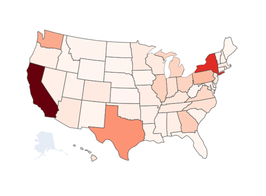

Understanding Superstore's Sales Data using EDA and Regression
======================================================
  

# 1. Introduction

With growing demand in the market, a Supertore giant likes to have a better understanding of what factors matter to their sales.

The dataset is from [Kaggle](https://www.kaggle.com/datasets/vivek468/superstore-dataset-final) and was collected between Jan. 2014 and Jan. 2018 across 49 states in the US.

The capstone project contains four parts: data cleaning, exploratory data analysis, preprocessing, final model selection.

# 2. Data Wrangling

# 3. Exploratory Data Analysis  [(EDA)](https://github.com/livia360/Capstone_project2/blob/7cbf2ebc5544a27ae39cbc7a23257153c0089299/Part1_data_wrangling_and_EDA.ipynb)

**Total Sales/Profits per State**  

**Total Sales/Profits per Region**

**Total Sales/Profits per Category**  

**Total Sales/Profits per Segment**

**Total Sales/Profits - Top 10 States**

**Total Sales/Profits - Top 10 Cities**

**ANOVA test** 
-Use a ANOVA when you want to know how independent variables, in combination, affect a dependent variable.

**Heatmap gives us a sense of the important features to the sales**
  

  

  
 
Through the images generated by wordcloud, we can see:

- **"xerox" and "ring binder"** are the two most important words that were repeatedly mentioned in the product names. This is not very surprising since we found out 'office supplies' has the largest volumes of orders.
- Two band names that stand out from this analysis are **"newell" and "wilson jones'**, Newell Brands is an American worldwide manufacturer of consumer and commercial products with a portfolio of brands including: Rubbermaid storage, home organization and writing instruments, etc. Wilson Jones is the inventor and supplier of the three ring binder.
- **'New York'** in the east region, **'Los Angles' and ' San Francisco'** in the west region are the top three most important cities. It makes sense because they are the cities with large amount of sales of products. 

# 4. Data Preprocessing 
  

**PCA**
- **The first two components account for about 60% of the variance, and the first five for over 85%.**   
  

The blue points represent the lower quartile of 'profit' and spread across the first dimension (>0).

# 5. Modeling

-[final_slides](https://github.com/livia360/Capstone_project2/blob/5e4af91cc8ed02babe860b1cad82bac0c58a978b/Capstone2_Sales_Regression_models_deck.pdf)

